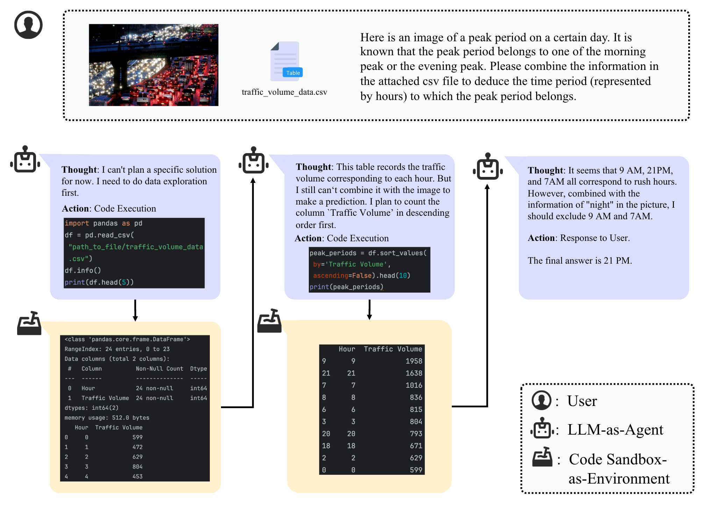

<h1 align="center">
BabelBench
</h1>

<div align="center">


</div>

<!-- 
[](https://github.com/InfiAgent/ADA-agent/blob/main/LICENSE)
[]
[]
[] -->
<!--  -->

# Dataset

## Example


## Model Perforamnce


## Files
The dataset includes the following files:
- `data/benchmark.csv`: The CSV file containing the questions, annotations and the meta information.
- `data/000-csvs`: The table files used in the benchmark.
- `data/000-imgs`: The images used in the benchmark.

## Data Format
The `benchmark.csv` file contains the following columns:
- `tag` (string): The subcategory of the problem.
- `prompt` (string): The problem with the response format constraints.
- `imgs` (list[string]): The image names to solve the problem.
- `imgs_src` (list[string]): The source URLs of the involved images.
- `attachments` (string): The table names to solve the problem.
- `attachments_src` (str): The source of the involved tables.
- `prompt_type` (string): Type of the prompt. It has not been reviewed for accuracy and is for reference only.
- `eval_info` (string): The annotation of the evaluation information.
- `difficulty` (string): The difficulty of the problem.


# Usage of the Eval Script

1. Refer to the provided file ("data/output/results_chatgpt.jsonl") to construct the corresponding result file (you can directly run our pipeline to obtain it). Specify `in_path` as the result file in `cal_eval_metric.py`.

2. Run `cal_eval_metric.py`.

3. (Optional) Or you can directly use the `mmAgentBenchEval` class in `cal_eval_metric.py`.


# Usage of the Framework

## Installation

BabelBench requires **Python version >= 3.9**.

1. Install babelbench and requirements
```
pip install .
```

2. Prepare model client. (e.g., `mmInfiAgent/pipeline/src/infiagent/llm/client/azure_openai.py`)

3. (Optional) Some models support passing image URLs. For these models, we prioritize passing the URL rather than reading images from local files and performing encoding and sampling. Therefore, for these models, you may need to upload the images to a server accessible from the internet in advance.

3. Run the command:
```bash
# api_key is required for API-based models
python activities/eval.py --config_path path_to_config --open_path_img url_of_open_server --output path_for_save
```


